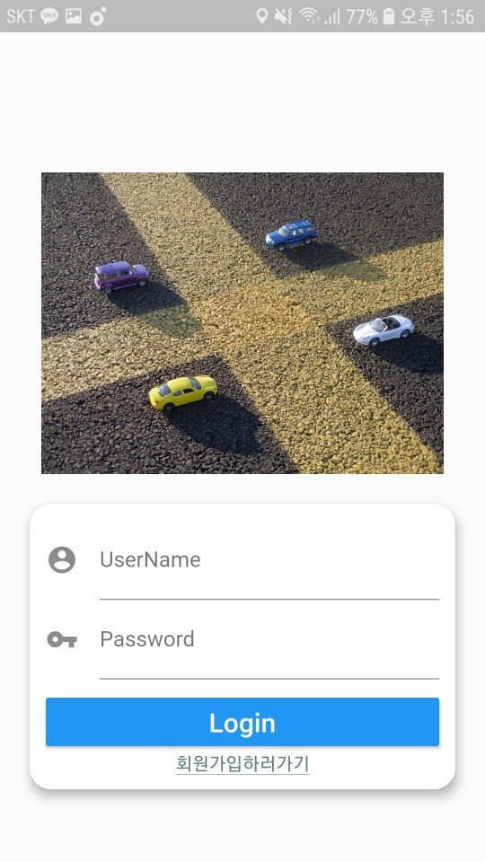
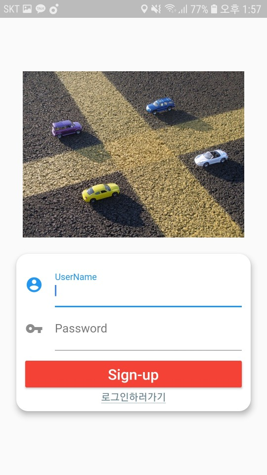
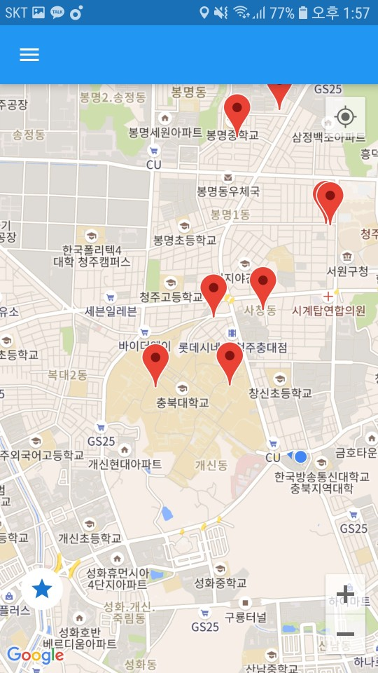
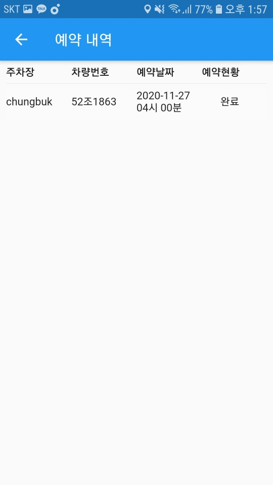
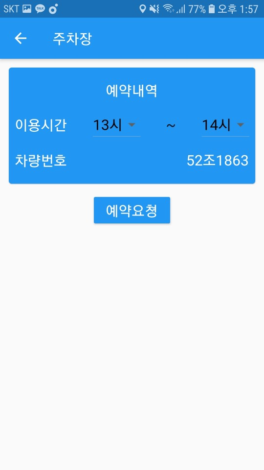

## 무인 주차시스템 애플리케이션

Flutter로 작성된 무인 주차시스템 Application.

- Google Map API 사용

- 전화, GPS Service 사용

- 유저와 즐겨찾기주차장 Provider롤 통한 상태관리

---

앱 실행 시 최초 보이는 화면

회원가입하러가기 버튼 클릭시 ChangeNotifier를 통해 회원가입변경

로그인 이후 보이는 메인화면. 지도 부분은 홈화면

Drawer메뉴에서 예약내역 선택 시 보이는 예약내역화면

지도의 마커 클릭 시 보이는 주차장화면

예약 버튼 클릭 시 보이는 예약화면

---

### 개선점

- 통일되지 못한 모듈구조 => 모듈구조 변경

- 비즈니스 로직과 UI 코드 혼합 => BloC패턴 적용하여 분리

For help getting started with Flutter, view our
[online documentation](https://flutter.dev/docs), which offers tutorials,
samples, guidance on mobile development, and a full API reference.
